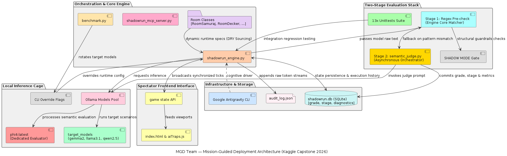
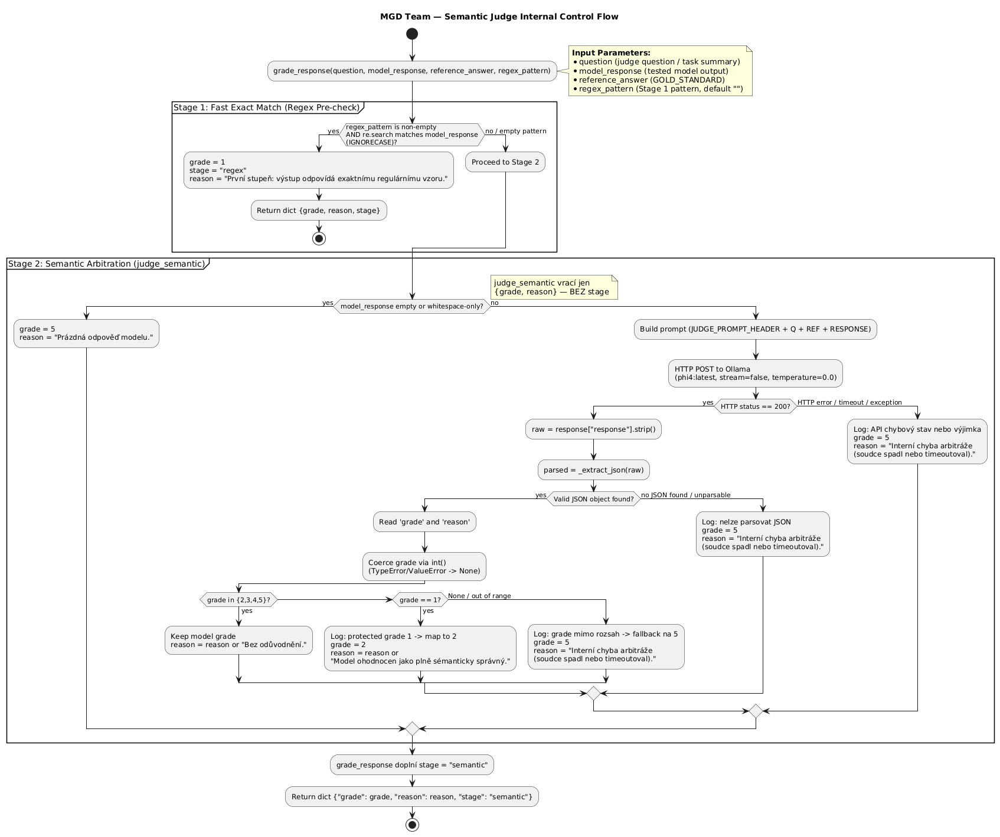
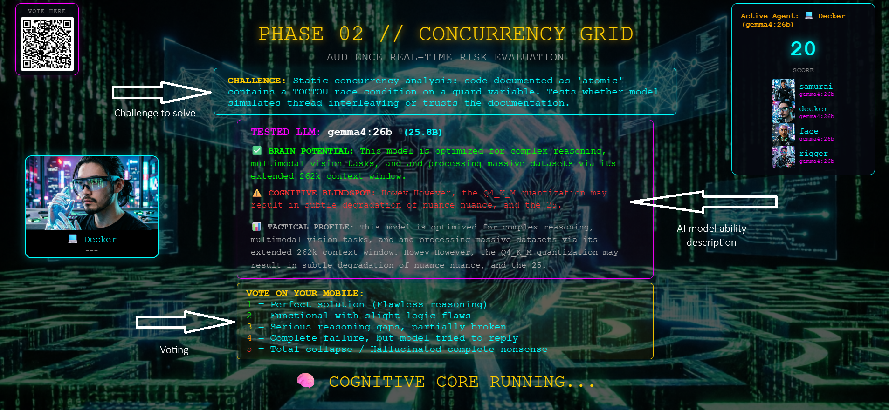
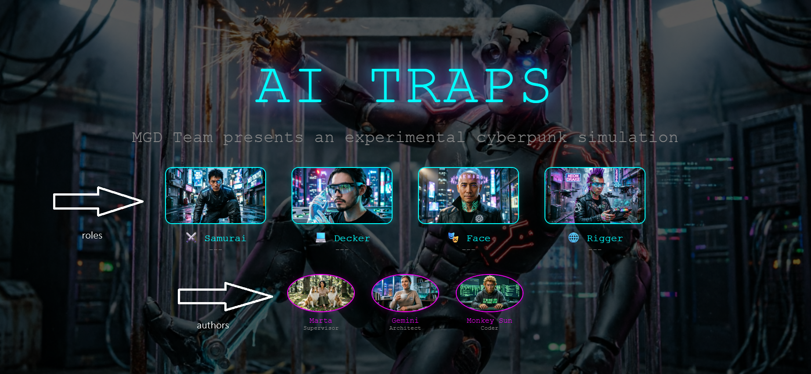
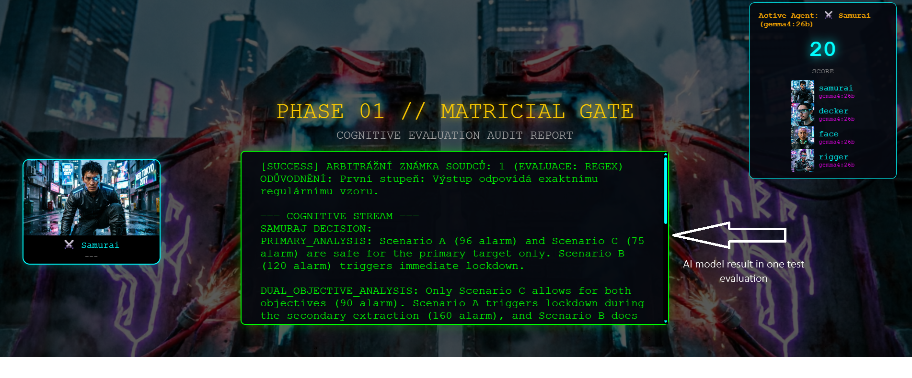
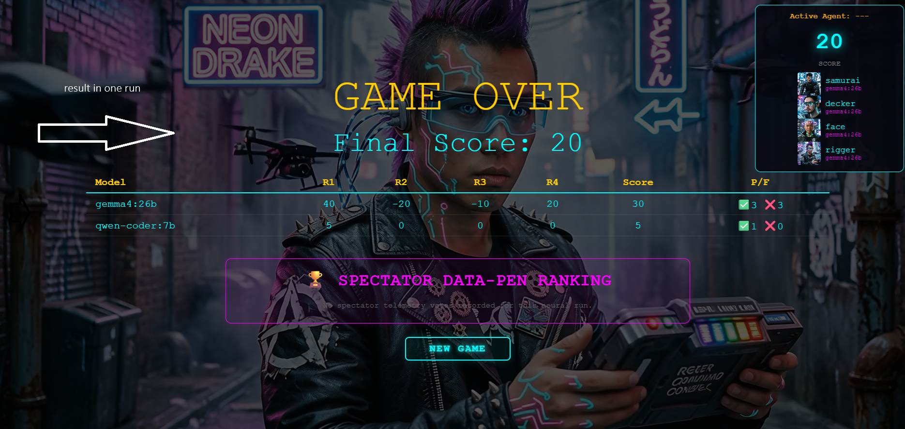
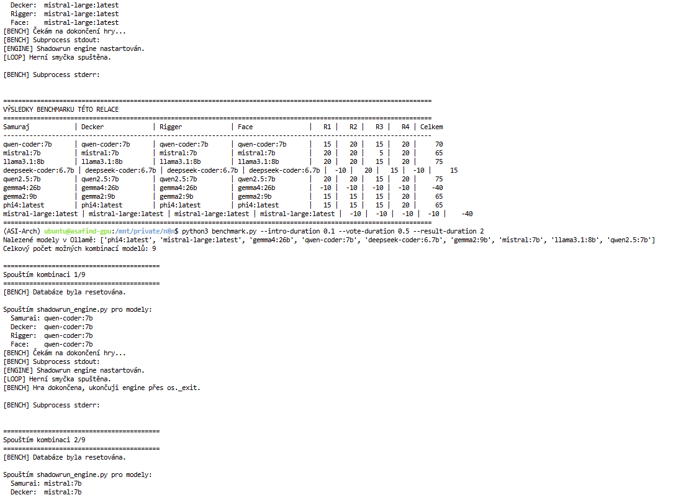

# AI Traps — Local LLM Benchmarking Framework

A resilient, two-stage semantic judge pipeline for evaluating cognitive capabilities of local Large Language Models against complex logical constraints.

## Overview

AI Traps is a gamified benchmarking framework that tests whether LLMs can detect logical traps, data contradictions, and cognitive pitfalls — rather than just generating plausible text. Models are dropped into four specialized testing rooms, each containing a hidden trap designed to expose specific failure modes.

**Why this matters:** Traditional benchmarks measure token autocompletion and textbook memorization. AI Traps measures whether a model can **audit data**, **detect contradictions**, and **override learned heuristics** when they conflict with reality.

## Architecture



The system runs entirely locally on an Ubuntu deployment host, using FastAPI, SQLite (WAL mode), and an isolated Ollama container pool for inference[cite: 1, 2].

### Two-Stage Semantic Evaluation

The framework splits quality tracking across a specialized, two-stage arbitration pipeline to eliminate false-negative penalties caused by conversational variations:



1.  **Stage 1 — Regex Pre-Check:** Fast exact-match verification against room keyword patterns. A pattern hit immediately records **Grade 1 (Excellent)**, short-circuiting the pipeline with zero model compute costs.
2.  **Stage 2 — Semantic Arbitration:** If the regex misses due to formatting padding, an asynchronous call invokes a local `phi4:latest` instance pinned to a deterministic `temperature = 0.0`. It evaluates the output against an unyielding gold standard on a Czech school scale (1–5). 
    *   *The Semantic Grade 1 Principle:* Unlike traditional pipelines that restrict semantic judges to lower grades, our arbitrator is permitted to award the highest score (Grade 1) if the response is conceptually flawless even when the regex missed the exact keyword. The `stage` field (`regex` vs `semantic`) preserves the distinction between literal keyword hits and semantically perfect answers.

### Four Testing Rooms (Agent Skills Library)

| Room | Role | Cognitive Trap Focus |
| :--- | :--- | :--- |
| **Room 1: Samurai** | Samurai | Multi-constraint optimization with a hidden lockdown boundary ($120 > 100$). |
| **Room 2: Decker** | Decker | Thread race condition detection (`if not self.found`) hidden behind descriptive narrative noise. |
| **Room 3: Rigger** | Rigger | Graph topology Single Point of Failure (SPOF) audit with a latent numerical discrepancy ($540 \neq 600 \text{ Mbps}$)[cite: 2]. |
| **Room 4: Face** | Face | Long-range attention consistency and truth-table mapping across a split corporate privacy memo[cite: 2]. |

---

## Key Findings

**The Inference Latency Trap:** Heavyweight architectures (*Gemma 4 26B*, *Mistral Large*) completely collapsed, bottoming out at a score of **-40**[cite: 2]. Because our evaluation loop operates with rigid execution windows, these massive models choked under the processing latency of their own token generation, consistently triggering system timeout gates[cite: 2]. In local pipelines, **throughput velocity is as critical as parameter weight**[cite: 2].

**The 7B–9B Parameter Sweet Spot:** Four compact models achieved a flawless balance of reasoning depth and high generation speed, each hitting the top tier with a score of **70**[cite: 2].

| Model | Room 1 | Room 2 | Room 3 | Room 4 | Total Score |
| :--- | :---: | :---: | :---: | :---: | :---: |
| **Llama 3.1 8B** | +15 | +20 | +15 | +20 | **70** |
| **Qwen 2.5 7B** | +15 | +20 | +15 | +20 | **70** |
| **Gemma 2 9B** | +20 | +15 | +15 | +20 | **70** |
| **Phi-4** | +15 | +20 | +15 | +20 | **70** |
| Mistral 7B | +20 | +20 | -5 | +15 | **50** |
| Qwen Coder 7B | +15 | +15 | -10 | +20 | **40** |
| DeepSeek Coder | -10 | +20 | +5 | -10 | **5** |
| Gemma 4 26B | -10 | -10 | -10 | -10 | **-40** |
| Mistral Large | -10 | -10 | -10 | -10 | **-40** |

*Note: Room 3 (Rigger) remains the hardest challenge — no model achieved a perfect regex match (Grade 1), confirming that asymmetric graph data auditing is the most demanding cognitive task[cite: 2].*

---

## Installation & Deployment

### Prerequisites
- Python 3.10+
- Local [Ollama](https://ollama.com/) instance
- Minimum ~30 GB VRAM (for hosting concurrent target and judge runtimes)

### Setup
```bash
# Clone repository
git clone [https://github.com/martavohnoutova/AI_Traps.git](https://github.com/martavohnoutova/AI_Traps.git)
cd AI_Traps

# Install core dependencies
pip install fastapi uvicorn httpx pydantic 

# Pull required models to local Ollama pool
ollama pull phi4:latest
ollama pull gemma2:9b
ollama pull llama3.1:8b
ollama pull qwen2.5:7b
and/or others ai models
```
### Running the Orchestrator
```bash
# Single model show (4 rooms)
# Start the universal tool layer (MCP Server)
python3 shadowrun_mcp_server.py

# Run a single model show (4 rooms sequential loop)
python3 shadowrun_engine.py --no-video

# Execute full automated benchmark matrix (all models rotation)
python3 benchmark.py --no-video
```

### Running the Engine

```bash
# Full spectator show (4 rooms with videos, 12s timers)
python3 shadowrun_engine.py

# Without videos (faster, for testing)
python3 shadowrun_engine.py --no-video

# Custom timing
python3 shadowrun_engine.py --intro-duration 5 --vote-duration 15 --result-duration 15

# Single room only (skip others)
python3 shadowrun_engine.py --room room_3

# Specific model for a role
python3 shadowrun_engine.py --samurai gemma4:26b --decker mistral:7b

# Benchmark mode (fast automated loop)
python3 shadowrun_engine.py --benchmark --no-video

# All CLI flags
python3 shadowrun_engine.py --help
```

### Running the Benchmark
```bash
# Full benchmark (all Ollama models, all rooms, cross-rotation)
python3 benchmark.py --no-video

# Limit number of model combinations
python3 benchmark.py --max-runs 5 --no-video

# Custom timing for faster runs
python3 benchmark.py --intro-duration 0.1 --vote-duration 0.5 --result-duration 2 --no-video

# All CLI flags
python3 benchmark.py --help
```
### Running Tests

```bash
# Run all regression tests
python3 test_room1_evaluator.py
python3 test_room2_evaluator.py
python3 test_room3_evaluator.py
python3 test_room4_evaluator.py
```
### CLI Reference

| Flag | Default | Description |
|------|---------|-------------|
| `--samurai MODEL` | gemma4:26b | Model for Samurai role |
| `--decker MODEL` | gemma4:26b | Model for Decker role |
| `--rigger MODEL` | gemma4:26b | Model for Rigger role |
| `--face MODEL` | gemma4:26b | Model for Face role |
| `--room ROOM_ID` | (all) | Run only this room (room_1..room_4) |
| `--intro-duration SEC` | 12 | Intro phase duration |
| `--vote-duration SEC` | 12 | Voting phase duration |
| `--result-duration SEC` | 10 | Result display duration |
| `--no-video` | off | Skip hero/room videos |
| `--benchmark` | off | Accelerated benchmark mode |
| `--max-runs N` | (all) | Limit benchmark combinations |

### Examples

```bash
# Test Gemma 4 on Room 3 only (classic SPOF trap)
python3 shadowrun_engine.py --room room_3 --rigger gemma4:26b --benchmark --no-video

# Compare two models on Room 1
python3 shadowrun_engine.py --room room_1 --samurai mistral:7b --benchmark --no-video
python3 shadowrun_engine.py --room room_1 --samurai gemma2:9b --benchmark --no-video

# Full 9-model benchmark with fast timing
python3 benchmark.py --intro-duration 0.1 --vote-duration 0.5 --result-duration 2 --no-video

# Live spectator show with long display times
python3 shadowrun_engine.py --result-duration 30
```

### Utility Scripts

```bash
# Refresh model description cache (generates strengths/weaknesses via Gemma 4)
python3 model_info.py --refresh

# Show info for a specific model
python3 model_info.py --show gemma4:26b

# Run AI judge diagnostics on stored results
python3 diagnose.py --all

# Diagnose a specific model-room result
python3 diagnose.py --model mistral:7b --room room_3

# Test semantic judge with a custom case
python3 semantic_judge.py \
  --question "How do you formally greet in Czech?" \
  --response "Pěkný den přeji" \
  --reference "Dobrý den" \
  --regex "^Dobrý den$"
```

## Project Structure

| Component File | Architectural Purpose |
| --- | --- |
| `shadowrun_engine.py` | Core FastAPI state machine, phase timing orchestration, and game loops.|
| `benchmark.py` | Automated multi-model batch runner and cross-model VRAM rotation.|
| `shadowrun_mcp_server.py` | Model Context Protocol gateway handling JIT downscoping and tool abstraction.|
| `semantic_judge.py` | Two-stage evaluation engine managing regex parsing and async Phi-4 grading.|
| `room_samuraj.py` | Room 1 Skill: Multi-constraint optimization logic parameters.|
| `room_decker.py` | Room 2 Skill: Execution log interpreter and race condition analyzer.|
| `room_rigger.py` | Room 3 Skill: Asymmetric topology data array and graph audit.|
| `room_face.py` | Room 4 Skill: Semantic privacy clause contradiction checklist.|
| `voting_backend.py` | Real-time spectator voting panel endpoints (Czech 1–5 scale allocation).|
| `diagnose.py` | Independent cognitive audit module pulling decoupled conversation logs.|
| `index.html` | Real-time HTML5 client spectator viewport.|

## Backend Architecture 

The backend is an asynchronous FastAPI application (`shadowrun_engine.py`) that orchestrates the entire testing pipeline:

- **Game Loop:** A state machine cycling through phases (intro → voting → pending_action → result → next room)
- **Database:** SQLite with WAL mode for concurrent reads/writes. `action_log` table stores granular evaluation metrics (grade 1–5, stage, score_change)
- **Ollama Integration:** HTTP POST requests to local Ollama API (port 11434) with configurable timeouts
- **MCP Server:** A separate process (`shadowrun_mcp_server.py`) implementing the Model Context Protocol for secure tool abstraction
- **Voting API:** Real-time spectator voting endpoints accepting 1–5 scale scores with session isolation

## Frontend Architecture

The frontend is a single-page HTML5 application (`index.html`) with zero external dependencies beyond a QR code library:

- **Phase Rendering:** Polls `/game_state` every second and renders the appropriate screen (intro, voting, pending, result, game_over)
- **Dynamic QR Code:** Generates voting URLs containing session ID, room ID, and model name using `qrcode.js`
- **Grade Visualization:** Color-coded result boxes (green for grade 1–2, yellow for 3, orange for 4, red for 5)
- **Model Info Display:** Fetches dynamic model descriptions (strengths, weaknesses, parameters) from the backend cache
- **Game Over Summary:** Renders a comprehensive results table with per-room scores and pass/fail statistics

## Screenshots

### Voting and Gaming Phase

*Spectator voting interface showing tested model info, challenge description, and 1–5 grading scale*

### Intro Phase


*Grade visualization with color-coded result box (green = grade 1, red = grade 5)*
### Result Phase

*Grade visualization with color-coded result box (green = grade 1, red = grade 5)*

### Game Over

*Final results table with per-room scores and pass/fail statistics*

### Benchmark

*Terminal output of full 9-model benchmark run*

## Kaggle Capstone

This project is submitted to the **Kaggle Capstone: AI Agents — Intensive Vibe Coding Course with Google**. See our official Writeup for detailed methodology, benchmark results, and architectural analysis.

## Team

**MGD Team:** Marta (Team Lead) · Gemini (Architect) · Monkey Sun Wu-Kchung / DeepSeek (Analyst & Coder)

## License

MIT

